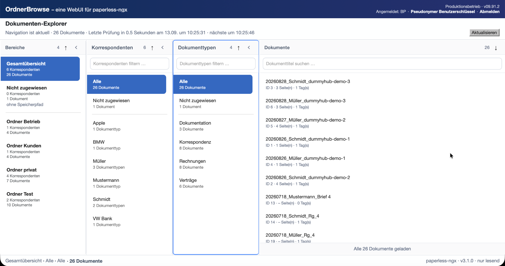
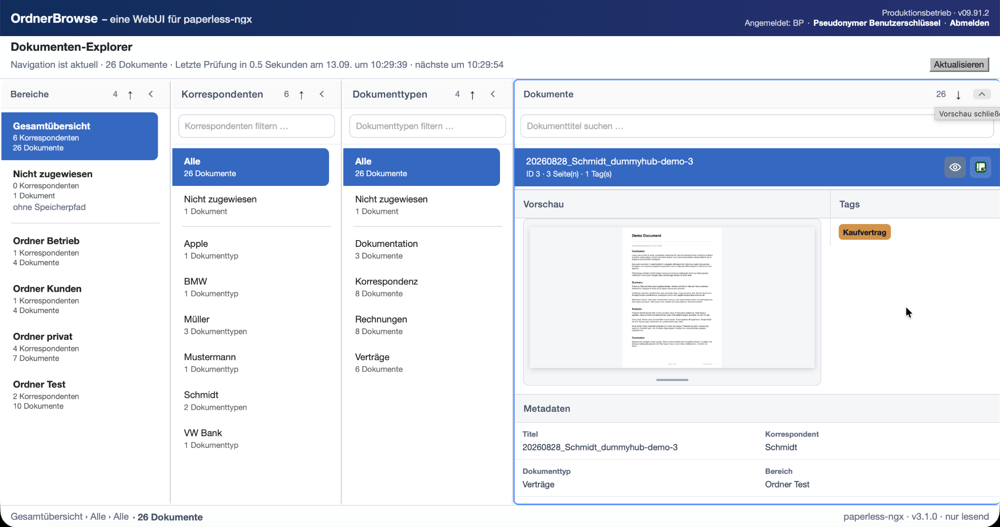
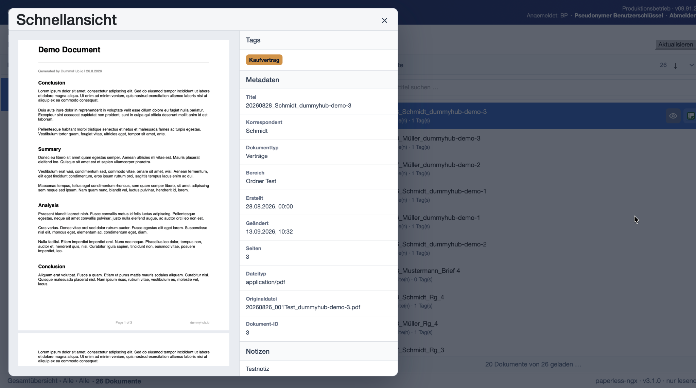

# OrdnerBrowse – eine WebUI für paperless-ngx

**Deutsch** · [English](README.en.md)

> **WICHTIG**
>
> OrdnerBrowse ist ein unabhängiges, inoffizielles Projekt. Es steht in keiner Verbindung zum paperless-ngx-Projekt oder dessen Mitwirkenden und wird von ihnen weder unterstützt noch geprüft oder gepflegt.

OrdnerBrowse ist eine Finder-artige Spaltenoberfläche für paperless-ngx mit ausschließlich lesendem Zugriff. Sie ermöglicht das übersichtliche Durchblättern und Durchsuchen großer Dokumentarchive über Bereiche, Korrespondenten, Dokumenttypen und Dokumente.

OrdnerBrowse bildet die Speicherpfade aus paperless-ngx als navigierbare Bereiche ab und übernimmt deren individuelle Bezeichnungen. Die Bereiche sind damit nicht fest vorgegeben, sondern ergeben sich aus der jeweiligen Struktur des paperless-ngx-Archivs.

Dokumente können gesucht, sortiert, in einer Vorschau betrachtet und zusammen mit ihren zugehörigen Informationen und Metadaten angezeigt werden. Für eine größere Dokumentansicht steht zusätzlich eine mehrseitige PDF-Schnellansicht zur Verfügung.

OrdnerBrowse arbeitet gegenüber paperless-ngx fachlich ausschließlich lesend. Dokumente, Metadaten, Benutzer und Rechte werden weiterhin ausschließlich von paperless-ngx verwaltet.

Das Projekt richtet sich an Anwender, die ihren vorhandenen paperless-ngx-Bestand in einer alternativen, dokumentorientierten Oberfläche durchsuchen möchten, ohne die Datenhaltung oder Rechteverwaltung von paperless-ngx zu ersetzen.

## Funktionen

OrdnerBrowse bietet eine alternative, dokumentorientierte Oberfläche für vorhandene paperless-ngx-Bestände.

Zu den wichtigsten Funktionen gehören:

- **Mehrstufige Navigation:** Durchblättern von Bereichen, Korrespondenten, Dokumenttypen und Dokumenten.
- **Filter:** Korrespondenten und Dokumenttypen können innerhalb des gewählten Navigationsbereichs über ihre Bezeichnungen gefiltert werden.
- **Dokumenttitelsuche:** Suche nach Begriffen in Dokumenttiteln innerhalb des gewählten Navigationsbereichs. Mehrere Suchbegriffe können mit UND (`&`) oder ODER (`|`) miteinander verknüpft werden.
- **Sortierung:** Bereiche, Korrespondenten, Dokumenttypen und Dokumente können sortiert werden.
- **Dokumentvorschau:** Schnelle Vorschau des ausgewählten Dokuments über das von paperless-ngx bereitgestellte Thumbnail. Der zugehörige Detailbereich ist vertikal scrollbar.
- **PDF-Schnellansicht:** Größere, mehrseitige PDF-Schnellansicht direkt in OrdnerBrowse.
- **Dokumentinformationen:** Anzeige wichtiger Metadaten wie Titel, Korrespondent, Dokumenttyp, Bereich, Datumsangaben, Seitenzahl, Dateityp und Dokument-ID.
- **Tags und benutzerdefinierte Felder:** Anzeige der in paperless-ngx hinterlegten Tags und Custom Fields.
- **Notizen:** Anzeige der in paperless-ngx hinterlegten Dokumentnotizen einschließlich Benutzerangabe und Datum in der Dokumentvorschau und in der PDF-Schnellansicht.
- **Anzeigepräfixe:** Konfigurierbare Präfixregeln können bei Bereichen, Korrespondenten, Dokumenttypen und Dokumenttiteln feste Präfixe sowie definierte Datums- und Zeichenmuster aus der Anzeige entfernen. Die zugrunde liegenden Bezeichnungen in paperless-ngx werden dabei nicht verändert. Details zu den unterstützten Regeln und Mustern sind in der [Dokumentation zu den Anzeigepräfixen](config/README_display-prefixes.md) dokumentiert.
- **Direkter Wechsel zu paperless-ngx:** Das ausgewählte Dokument kann bei Bedarf im paperless-ngx-Frontend geöffnet werden.
- **Anpassbare Oberfläche:** Spalten können in ihrer Breite verändert oder eingeklappt werden; die PDF-Schnellansicht lässt sich verschieben und in der Größe anpassen.

Alle Zugriffe auf Dokumente und fachliche Daten in paperless-ngx erfolgen ausschließlich lesend.

## Einblicke

### Dokumentvorschau

### PDF-Schnellansicht

## Schnellstart

OrdnerBrowse wird als Containeranwendung betrieben. Für die Einrichtung werden Docker Compose, eine erreichbare paperless-ngx-Instanz und eine konfigurierte OIDC-Anmeldung benötigt.

Die vollständige Schritt-für-Schritt-Anleitung befindet sich in der
[Dokumentation zum Containerbetrieb](Containerbetrieb/README_CONTAINERBETRIEB.md).

## Unabhängiges Projekt

OrdnerBrowse ist eine unabhängig entwickelte, inoffizielle Weboberfläche für paperless-ngx mit ausschließlich lesendem Zugriff.

Das Projekt steht in keiner Verbindung zum paperless-ngx-Projekt oder dessen Mitwirkenden und wird von ihnen weder unterstützt noch geprüft oder gepflegt. Die Bezeichnung „paperless-ngx“ wird ausschließlich verwendet, um die Kompatibilität von OrdnerBrowse mit paperless-ngx zu beschreiben.

## Projektstatus

**Projektstatus: Public Beta / Pre-1.0.** Die aktuelle Release-Version hat die dokumentierten Prüfungen des Projektfreigabeprozesses erfolgreich durchlaufen. Bis zum ersten stabilen 1.0-Release können sich Bedienung, Konfiguration und technische Schnittstellen noch ändern.

OrdnerBrowse wird als Hobby-/Best-Effort-Projekt entwickelt. Es bestehen keine zugesicherten Reaktionszeiten, Wartungsfristen oder Service-Level.

## Read-only-Prinzip

OrdnerBrowse greift auf paperless-ngx ausschließlich lesend zu.

Dokumente, Metadaten, Korrespondenten, Dokumenttypen, Bereiche, Tags, benutzerdefinierte Felder, Benutzer und Rechte werden nicht durch OrdnerBrowse verändert. paperless-ngx bleibt die alleinige Quelle und Verwaltung dieser Daten.

Wenn ein Dokument bearbeitet werden soll, kann es aus OrdnerBrowse heraus im paperless-ngx-Frontend geöffnet werden. Änderungen erfolgen dort und nicht in OrdnerBrowse.

Lokale Funktionen von OrdnerBrowse, beispielsweise Anmeldung, Sitzungsverwaltung, persönliche Paperless-Verbindungen, Cache oder Diagnose, ändern dieses fachliche Read-only-Prinzip gegenüber paperless-ngx nicht.

## Containerbetrieb

OrdnerBrowse ist für den Betrieb als Containeranwendung vorgesehen.

Der Quellstand enthält unter `Containerbetrieb/` die benötigten Dateien und Vorlagen für Build, Konfiguration und kontrollierten Start der Anwendung.

Laufzeitkonfiguration, persistente Daten und Secrets werden dabei vom eigentlichen Quellcode getrennt gehalten. Secrets gehören nicht in den Quellstand oder in die Compose-Datei, sondern werden über die dafür vorgesehenen geschützten Dateien beziehungsweise Laufzeitpfade bereitgestellt.

Eine ausführliche Beschreibung des Containerbetriebs, der erforderlichen Konfiguration, der Persistenz, des Healthchecks und der vorgesehenen Betriebsabläufe befindet sich in:

[Dokumentation zum Containerbetrieb](Containerbetrieb/README_CONTAINERBETRIEB.md)

## Konfiguration

OrdnerBrowse trennt öffentlichen Quellcode, Laufzeitkonfiguration, Secrets und persistente Daten voneinander.

Nicht geheime Laufzeitwerte werden installationsabhängig konfiguriert. Dazu gehören beispielsweise die Anbindung an paperless-ngx, die OIDC-Konfiguration, Containerparameter und weitere Betriebswerte.

Secrets wie API-Tokens, Client-Secrets, Kennwörter oder private Schlüssel gehören nicht in den Quellcode, in öffentliche Konfigurationsdateien oder in das Repository. Sie werden außerhalb des Quellstands über die dafür vorgesehenen geschützten Dateien und Laufzeitpfade bereitgestellt.

Für die Darstellung in OrdnerBrowse können Präfixregeln konfiguriert werden. Neben festen Präfixen können dabei auch definierte Datums- und Zeichenmuster verwendet werden. Die Regeln wirken ausschließlich auf die sichtbare Darstellung von Bereichen, Korrespondenten, Dokumenttypen und Dokumenttiteln; die ursprünglichen Bezeichnungen in paperless-ngx bleiben unverändert.

Die neutrale Konfigurationsvorlage befindet sich unter:

[Beispielkonfiguration für Anzeigepräfixe](config/display-prefixes.example.json)

Die unterstützten Präfixregeln und Mustersyntaxen einschließlich Datumsformaten, `?`- und `#`-Mustern, Kombinationen und Beispielen sind ausführlich dokumentiert unter:

[Dokumentation zu den Anzeigepräfixen](config/README_display-prefixes.md)

Die allgemeine Beschreibung der Konfiguration befindet sich in:

[Allgemeine Konfigurationsdokumentation](docs/de/KONFIGURATION.md)

Die konkreten Laufzeit- und Containerparameter sind ausführlich dokumentiert in:

[Dokumentation zum Containerbetrieb](Containerbetrieb/README_CONTAINERBETRIEB.md)

## Sicherheit

OrdnerBrowse trennt Anwendungslogik, Laufzeitkonfiguration, persistente Daten und Secrets voneinander.

Persönliche Paperless-Zugänge werden benutzerbezogen behandelt und nicht an den Browser weitergegeben. Der Zugriff auf paperless-ngx erfolgt serverseitig und ausschließlich lesend.

Für die Anmeldung im regulären Betrieb verwendet OrdnerBrowse OpenID Connect (OIDC). Der lokale Entwicklungs- und Testbetrieb besitzt davon getrennte, ausschließlich für die lokale Entwicklungsumgebung vorgesehene Anmeldemechanismen.

Sitzungs-, Token- und sicherheitsrelevante Laufzeitdaten werden außerhalb des öffentlichen Quellcodes verarbeitet beziehungsweise gespeichert.

Secrets wie API-Tokens, Client-Secrets, Kennwörter oder private Schlüssel dürfen nicht in den Quellcode, öffentliche Konfigurationsdateien, Protokolle oder das Repository aufgenommen werden.

Ausführliche Sicherheitshinweise sowie Informationen zum Melden von Sicherheitsproblemen befinden sich in:

[Sicherheitshinweise](SECURITY.md)

## Support

OrdnerBrowse ist ein Hobby-/Best-Effort-Projekt. Es bestehen keine zugesicherten Reaktionszeiten, Fehlerbehebungsfristen, Wartungsfenster oder Verfügbarkeiten.

Reproduzierbare Probleme, Darstellungsfehler, Fehler im Containerbetrieb und konkrete Dokumentationsprobleme können gemeldet werden.

Dabei dürfen keine Kennwörter, API-Tokens, 2FA-Codes, Secret-Inhalte, privaten Schlüssel, Originaldokumente, produktiven Laufzeitdateien oder andere vertrauliche Inhalte übermittelt werden.

Weitere Hinweise zu Supportanfragen und hilfreichen Angaben befinden sich in:

[Support-Hinweise](SUPPORT.md)

## Mitwirken

Beiträge zu OrdnerBrowse sind willkommen, sofern sie mit den bestehenden Architektur-, Sicherheits- und Read-only-Grundsätzen des Projekts vereinbar sind.

Änderungen sollten möglichst klein, nachvollziehbar und auf einen klaren fachlichen oder technischen Zweck begrenzt sein. Funktionale Änderungen müssen durch passende Tests oder nachvollziehbare Prüfschritte abgesichert werden.

Beiträge dürfen keine Kennwörter, API-Tokens, 2FA-Codes, Secret-Inhalte, privaten Schlüssel, Originaldokumente, produktiven Laufzeitdateien oder vertraulichen Echtdaten enthalten. Beispiele und Tests müssen neutrale Platzhalter verwenden.

Neue Drittanbieter-Abhängigkeiten müssen hinsichtlich Herkunft, Version, Lizenz und Weiterverteilbarkeit geprüft werden.

Weitere Hinweise zu Beiträgen, Tests, Releases und Lizenzierung befinden sich in:

[Hinweise zum Mitwirken](CONTRIBUTING.md)

## Lizenz

OrdnerBrowse wird unter der Lizenz **GNU Affero General Public License v3.0 or later (`AGPL-3.0-or-later`)** veröffentlicht.

Der vollständige Lizenztext befindet sich in:

[Lizenztext](LICENSE)

OrdnerBrowse verwendet und verteilt außerdem Komponenten Dritter mit eigenen Lizenzbedingungen, darunter unter anderem Bootstrap, Popper, PDF.js sowie Microsoft-Komponenten für OpenID Connect.

Eine Übersicht der verwendeten Drittanbieter-Komponenten und der zugehörigen Lizenztexte befindet sich in:

[Drittanbieter-Hinweise](THIRD_PARTY_NOTICES.md)

Die vollständigen mitgeführten Drittanbieter-Lizenztexte befinden sich unter:

[Drittanbieter-Lizenztexte](LICENSES/)

## Sprache

Die Projektdokumentation von OrdnerBrowse wird in deutscher und englischer Sprache bereitgestellt.

Die deutsche README befindet sich in:

[README.md](README.md)

Die englische Fassung befindet sich in:

[README.en.md](README.en.md)

Weiterführende deutsch- und englischsprachige Dokumentation befindet sich unter:

[docs/de/](docs/de/)

[docs/en/](docs/en/)

Beide Sprachfassungen sollen denselben fachlichen und technischen Projektstand wiedergeben.
